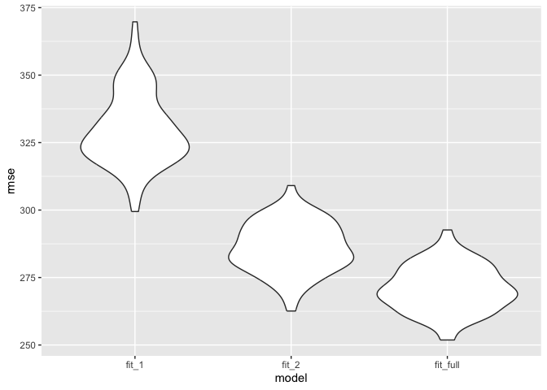

Data Science I Homework 6
================
Huanyu Chen
2023-11-28

# Problem 1

# Problem 2

## Load Data

``` r
weather_df = 
  rnoaa::meteo_pull_monitors(
    c("USW00094728"),
    var = c("PRCP", "TMIN", "TMAX"), 
    date_min = "2022-01-01",
    date_max = "2022-12-31") |>
  mutate(
    name = recode(id, USW00094728 = "CentralPark_NY"),
    tmin = tmin / 10,
    tmax = tmax / 10) |>
  dplyr::select(name, id, everything())
```

    ## using cached file: /Users/huanyu/Library/Caches/org.R-project.R/R/rnoaa/noaa_ghcnd/USW00094728.dly

    ## date created (size, mb): 2023-09-28 10:21:31.170075 (8.524)

    ## file min/max dates: 1869-01-01 / 2023-09-30

## Bootstrap

``` r
result = weather_df |>
  modelr::bootstrap(n = 500) |>
  mutate(
    weather_lm = map(strap, ~lm(tmax ~ tmin + prcp, data = .x)),
    weather_lm_r2 = map(weather_lm, broom::tidy),
    weather_lm_beta = map(weather_lm, broom::glance)
    ) |>
  unnest(weather_lm_r2, weather_lm_beta) |>
  dplyr::select(term, estimate, r.squared) |>
  pivot_wider(names_from = term, values_from = estimate) |>
  rename(
    beta_0 = `(Intercept)`,
    beta_1 = tmin,
    beta_2 = prcp) |>
  summarise(r_squared = r.squared,
            log_beta1_2 = log(beta_1*beta_2))
```

    ## Warning: `unnest()` has a new interface. See `?unnest` for details.
    ## ℹ Try `df %>% unnest(c(weather_lm_r2, weather_lm_beta))`, with `mutate()` if
    ##   needed.

    ## Warning: There was 1 warning in `summarise()`.
    ## ℹ In argument: `log_beta1_2 = log(beta_1 * beta_2)`.
    ## Caused by warning in `log()`:
    ## ! NaNs produced

    ## Warning: Returning more (or less) than 1 row per `summarise()` group was deprecated in
    ## dplyr 1.1.0.
    ## ℹ Please use `reframe()` instead.
    ## ℹ When switching from `summarise()` to `reframe()`, remember that `reframe()`
    ##   always returns an ungrouped data frame and adjust accordingly.
    ## Call `lifecycle::last_lifecycle_warnings()` to see where this warning was
    ## generated.

``` r
head(result)
```

    ## # A tibble: 6 × 2
    ##   r_squared log_beta1_2
    ##       <dbl>       <dbl>
    ## 1     0.885       -5.30
    ## 2     0.926      NaN   
    ## 3     0.937      NaN   
    ## 4     0.930      NaN   
    ## 5     0.919       -5.67
    ## 6     0.913       -5.38

## Plot Distributions: r^2

``` r
result |>
  ggplot(aes(x = r_squared)) +
  geom_histogram() +
  labs(title = "Distribution of r^2 Estimates",
       x = "r^2 estimates")
```

    ## `stat_bin()` using `bins = 30`. Pick better value with `binwidth`.

<!-- -->

According to the graph, we find that the estimates for r^2 are around
0.92, which means that `tmin` and `prcp` are good predictors of `tmax`.

## Plot Distributions: log(beta_1 \* beta_2)

``` r
result |>
  ggplot(aes(x = log_beta1_2)) +
  geom_histogram() +
  labs(title = "Distribution of log(beta_1 * beta_2) Estimates",
       x = "log(beta_1 * beta_2) estimates")
```

    ## `stat_bin()` using `bins = 30`. Pick better value with `binwidth`.

    ## Warning: Removed 328 rows containing non-finite values (`stat_bin()`).

<!-- -->

According to the graph, we find that the estimates for log(beta_1 \*
beta_2) are left skewed, with most frequencies around -6.

## 95% Confidence Interval

``` r
r2_ci = quantile(pull(result, r_squared),
                 probs = c(0.025,0.975))
r2_ci
```

    ##      2.5%     97.5% 
    ## 0.8848387 0.9400012

``` r
log_beta12_ci = quantile(pull(result, log_beta1_2),
                         probs = c(0.025,0.975), na.rm = TRUE)
log_beta12_ci
```

    ##      2.5%     97.5% 
    ## -9.283744 -4.427567

# Problem 3

## Load and Clean Data

``` r
birthweight = read.csv("./birthweight.csv")

birthweight <- birthweight |>
  janitor::clean_names() |>
  na.omit() |>
  mutate(babysex = case_when(babysex == 1 ~ 'male',
                             babysex == 2 ~ 'female'),
         frace = case_when(frace == 1 ~ "White",
                        frace == 2 ~ "Black",
                        frace == 3 ~ "Asian",
                        frace == 4 ~ "Puerto Rican",
                        frace == 8 ~ "Other",
                        frace == 9 ~ "Unknown"),
         malform = case_when(malform == 0 ~ 'absent',
                             malform == 1 ~ 'present'),
         mrace = case_when(mrace == 1 ~ "White",
                        mrace == 2 ~ "Black",
                        mrace == 3 ~ "Asian",
                        mrace == 4 ~ "Puerto Rican",
                        mrace == 8 ~ "Other")
         )
head(birthweight)
```

    ##   babysex bhead blength  bwt delwt fincome frace gaweeks malform menarche
    ## 1  female    34      51 3629   177      35 White    39.9  absent       13
    ## 2    male    34      48 3062   156      65 Black    25.9  absent       14
    ## 3  female    36      50 3345   148      85 White    39.9  absent       12
    ## 4    male    34      52 3062   157      55 White    40.0  absent       14
    ## 5  female    34      52 3374   156       5 White    41.6  absent       13
    ## 6    male    33      52 3374   129      55 White    40.7  absent       12
    ##   mheight momage mrace parity pnumlbw pnumsga    ppbmi ppwt smoken wtgain
    ## 1      63     36 White      3       0       0 26.27184  148      0     29
    ## 2      65     25 Black      0       0       0 21.34485  128      0     28
    ## 3      64     29 White      0       0       0 23.56517  137      1     11
    ## 4      64     18 White      0       0       0 21.84508  127     10     30
    ## 5      66     20 White      0       0       0 21.02642  130      1     26
    ## 6      66     23 White      0       0       0 18.60030  115      0     14

## Regression Model

The following code attempts to use backward stepwise regression.

``` r
full_model = lm(bwt ~ ., data = birthweight) |>
  step(direction = "backward", trace = FALSE)

summary(full_model)
```

    ## 
    ## Call:
    ## lm(formula = bwt ~ babysex + bhead + blength + delwt + fincome + 
    ##     gaweeks + mheight + mrace + parity + ppwt + smoken, data = birthweight)
    ## 
    ## Residuals:
    ##      Min       1Q   Median       3Q      Max 
    ## -1097.18  -185.52    -3.39   174.14  2353.44 
    ## 
    ## Coefficients:
    ##                     Estimate Std. Error t value Pr(>|t|)    
    ## (Intercept)       -6145.1507   141.9496 -43.291  < 2e-16 ***
    ## babysexmale         -28.5580     8.4549  -3.378 0.000737 ***
    ## bhead               130.7770     3.4466  37.944  < 2e-16 ***
    ## blength              74.9471     2.0190  37.120  < 2e-16 ***
    ## delwt                 4.1067     0.3921  10.475  < 2e-16 ***
    ## fincome               0.3180     0.1747   1.820 0.068844 .  
    ## gaweeks              11.5925     1.4621   7.929 2.79e-15 ***
    ## mheight               6.5940     1.7849   3.694 0.000223 ***
    ## mraceBlack          -63.9057    42.3663  -1.508 0.131523    
    ## mracePuerto Rican   -25.7914    45.3502  -0.569 0.569578    
    ## mraceWhite           74.8868    42.3146   1.770 0.076837 .  
    ## parity               96.3047    40.3362   2.388 0.017004 *  
    ## ppwt                 -2.6756     0.4274  -6.261 4.20e-10 ***
    ## smoken               -4.8434     0.5856  -8.271  < 2e-16 ***
    ## ---
    ## Signif. codes:  0 '***' 0.001 '**' 0.01 '*' 0.05 '.' 0.1 ' ' 1
    ## 
    ## Residual standard error: 272.3 on 4328 degrees of freedom
    ## Multiple R-squared:  0.7181, Adjusted R-squared:  0.7173 
    ## F-statistic: 848.1 on 13 and 4328 DF,  p-value: < 2.2e-16

## Plot Residuals Against Fitted Values

``` r
birthweight |>
    add_predictions(full_model) |>
    add_residuals(full_model) |>
    ggplot(aes(x = pred, y = resid)) +
    geom_point()  + 
    geom_smooth(method = "lm") + 
    labs(title = "Residuals Against Fitted Values", 
       x = "Fitted Values", 
       y = "Residuals")
```

    ## `geom_smooth()` using formula = 'y ~ x'

<!-- -->

# Compare Models

``` r
model_1 = lm(bwt ~ blength + gaweeks, data = birthweight)
summary(model_1)
```

    ## 
    ## Call:
    ## lm(formula = bwt ~ blength + gaweeks, data = birthweight)
    ## 
    ## Residuals:
    ##     Min      1Q  Median      3Q     Max 
    ## -1709.6  -215.4   -11.4   208.2  4188.8 
    ## 
    ## Coefficients:
    ##              Estimate Std. Error t value Pr(>|t|)    
    ## (Intercept) -4347.667     97.958  -44.38   <2e-16 ***
    ## blength       128.556      1.990   64.60   <2e-16 ***
    ## gaweeks        27.047      1.718   15.74   <2e-16 ***
    ## ---
    ## Signif. codes:  0 '***' 0.001 '**' 0.01 '*' 0.05 '.' 0.1 ' ' 1
    ## 
    ## Residual standard error: 333.2 on 4339 degrees of freedom
    ## Multiple R-squared:  0.5769, Adjusted R-squared:  0.5767 
    ## F-statistic:  2958 on 2 and 4339 DF,  p-value: < 2.2e-16

``` r
model_2 = lm(bwt ~ bhead * blength * babysex, data = birthweight)
summary(model_2)
```

    ## 
    ## Call:
    ## lm(formula = bwt ~ bhead * blength * babysex, data = birthweight)
    ## 
    ## Residuals:
    ##      Min       1Q   Median       3Q      Max 
    ## -1132.99  -190.42   -10.33   178.63  2617.96 
    ## 
    ## Coefficients:
    ##                             Estimate Std. Error t value Pr(>|t|)    
    ## (Intercept)                -801.9487  1102.3077  -0.728 0.466948    
    ## bhead                       -16.5975    34.0916  -0.487 0.626388    
    ## blength                     -21.6460    23.3720  -0.926 0.354421    
    ## babysexmale               -6374.8684  1677.7669  -3.800 0.000147 ***
    ## bhead:blength                 3.3244     0.7126   4.666 3.17e-06 ***
    ## bhead:babysexmale           198.3932    51.0917   3.883 0.000105 ***
    ## blength:babysexmale         123.7729    35.1185   3.524 0.000429 ***
    ## bhead:blength:babysexmale    -3.8781     1.0566  -3.670 0.000245 ***
    ## ---
    ## Signif. codes:  0 '***' 0.001 '**' 0.01 '*' 0.05 '.' 0.1 ' ' 1
    ## 
    ## Residual standard error: 287.7 on 4334 degrees of freedom
    ## Multiple R-squared:  0.6849, Adjusted R-squared:  0.6844 
    ## F-statistic:  1346 on 7 and 4334 DF,  p-value: < 2.2e-16

``` r
cv =
  crossv_mc(birthweight, 100) |>
  mutate(rmse_fit_full = map2_dbl(map(train,~full_model),
                                  test, ~rmse(model = .x,data = .y)),
         rmse_fit_1 = map2_dbl(map(train,~model_1),
                               test, ~rmse(model = .x,data = .y)),
         rmse_fit_2 = map2_dbl(map(train,~model_2),
                               test, ~rmse(model = .x,data = .y))
  )

head(cv)
```

    ## # A tibble: 6 × 6
    ##   train                   test                  .id   rmse_fit_full rmse_fit_1
    ##   <list>                  <list>                <chr>         <dbl>      <dbl>
    ## 1 <resample [3,473 x 20]> <resample [869 x 20]> 001            270.       327.
    ## 2 <resample [3,473 x 20]> <resample [869 x 20]> 002            262.       320.
    ## 3 <resample [3,473 x 20]> <resample [869 x 20]> 003            259.       322.
    ## 4 <resample [3,473 x 20]> <resample [869 x 20]> 004            278.       320.
    ## 5 <resample [3,473 x 20]> <resample [869 x 20]> 005            297.       371.
    ## 6 <resample [3,473 x 20]> <resample [869 x 20]> 006            272.       350.
    ## # ℹ 1 more variable: rmse_fit_2 <dbl>

``` r
cv |>
  dplyr::select(starts_with("rmse")) |>
  pivot_longer(
    everything(),
    names_to = "model", 
    values_to = "rmse",
    names_prefix = "rmse_") |>
  ggplot(aes(x = model, y = rmse)) + 
  geom_violin()
```

<!-- -->

Therefore, we know that the 11-variable backward stepwise regression
model has the smallest RMSE, indicating that the predictions in this
model are closer to the actual values than the other two.
