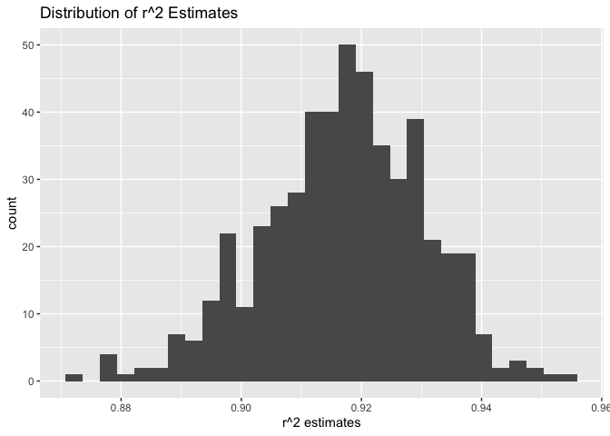
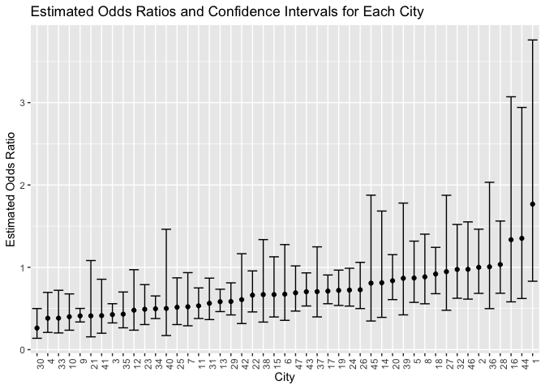

Data Science I Homework 6
================
Huanyu Chen
2023-11-27

# Problem 1

# Problem 2

## Load Data

``` r
weather_df = 
  rnoaa::meteo_pull_monitors(
    c("USW00094728"),
    var = c("PRCP", "TMIN", "TMAX"), 
    date_min = "2022-01-01",
    date_max = "2022-12-31") |>
  mutate(
    name = recode(id, USW00094728 = "CentralPark_NY"),
    tmin = tmin / 10,
    tmax = tmax / 10) |>
  dplyr::select(name, id, everything())
```

    ## using cached file: /Users/huanyu/Library/Caches/org.R-project.R/R/rnoaa/noaa_ghcnd/USW00094728.dly

    ## date created (size, mb): 2023-09-28 10:21:31.170075 (8.524)

    ## file min/max dates: 1869-01-01 / 2023-09-30

## Bootstrap

``` r
result = weather_df |>
  modelr::bootstrap(n = 500) |>
  mutate(
    weather_lm = map(strap, ~lm(tmax ~ tmin + prcp, data = .x)),
    weather_lm_r2 = map(weather_lm, broom::tidy),
    weather_lm_beta = map(weather_lm, broom::glance)
    ) |>
  unnest(weather_lm_r2, weather_lm_beta) |>
  dplyr::select(term, estimate, r.squared) |>
  pivot_wider(names_from = term, values_from = estimate) |>
  rename(
    beta_0 = `(Intercept)`,
    beta_1 = tmin,
    beta_2 = prcp) |>
  summarise(r_squared = r.squared,
            log_beta1_2 = log(beta_1*beta_2),
            log_beta0_1 = log(beta_0*beta_1))
```

    ## Warning: `unnest()` has a new interface. See `?unnest` for details.
    ## ℹ Try `df %>% unnest(c(weather_lm_r2, weather_lm_beta))`, with `mutate()` if
    ##   needed.

    ## Warning: There was 1 warning in `summarise()`.
    ## ℹ In argument: `log_beta1_2 = log(beta_1 * beta_2)`.
    ## Caused by warning in `log()`:
    ## ! NaNs produced

    ## Warning: Returning more (or less) than 1 row per `summarise()` group was deprecated in
    ## dplyr 1.1.0.
    ## ℹ Please use `reframe()` instead.
    ## ℹ When switching from `summarise()` to `reframe()`, remember that `reframe()`
    ##   always returns an ungrouped data frame and adjust accordingly.
    ## Call `lifecycle::last_lifecycle_warnings()` to see where this warning was
    ## generated.

``` r
head(result)
```

    ## # A tibble: 6 × 3
    ##   r_squared log_beta1_2 log_beta0_1
    ##       <dbl>       <dbl>       <dbl>
    ## 1     0.900       -4.97        2.06
    ## 2     0.935      NaN           2.08
    ## 3     0.909      NaN           2.10
    ## 4     0.925      NaN           2.11
    ## 5     0.898       -4.85        2.08
    ## 6     0.918      NaN           2.12

## Plot Distributions: r^2

``` r
result |>
  ggplot(aes(x = r_squared)) +
  geom_histogram() +
  labs(title = "Distribution of r^2 Estimates",
       x = "r^2 estimates")
```

    ## `stat_bin()` using `bins = 30`. Pick better value with `binwidth`.

<!-- -->

According to the graph, we find that the estimates for r^2 are around
0.92, which means that `tmin` and `prcp` are good predictors of `tmax`.

## Plot Distributions: log(beta_1 \* beta_2)

``` r
result |>
  ggplot(aes(x = log_beta1_2)) +
  geom_histogram() +
  labs(title = "Distribution of log(beta_1 * beta_2) Estimates",
       x = "log(beta_1 * beta_2) estimates")
```

    ## `stat_bin()` using `bins = 30`. Pick better value with `binwidth`.

    ## Warning: Removed 342 rows containing non-finite values (`stat_bin()`).

<!-- -->

According to the graph, we find that the estimates for log(beta_1 \*
beta_2) are left skewed, with most frequencies around -6.

## 95% Confidence Interval

``` r
r2_ci = quantile(pull(result, r_squared),
                 probs = c(0.025,0.975))
r2_ci
```

    ##      2.5%     97.5% 
    ## 0.8910332 0.9404901

``` r
log_beta01_ci = quantile(pull(result, log_beta0_1),
                         probs = c(0.025,0.975))
log_beta01_ci
```

    ##     2.5%    97.5% 
    ## 2.055163 2.135699

# Problem 3
