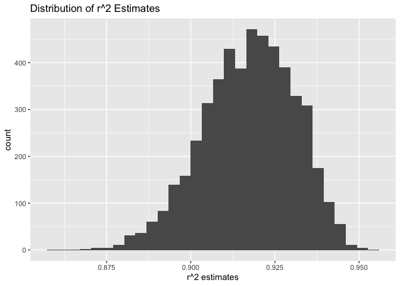
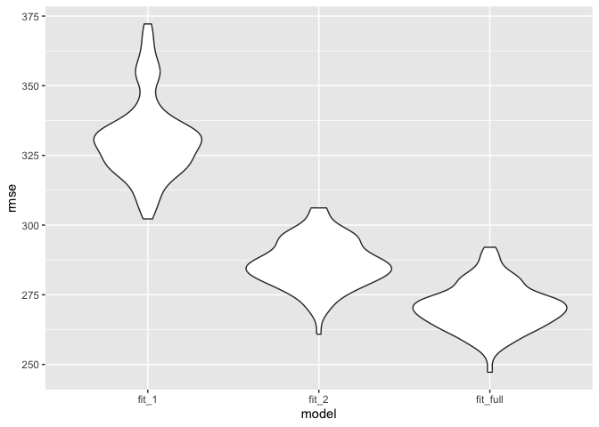

Data Science I Homework 6
================
Huanyu Chen
2023-11-29

# Problem 1

## Load and Clean Data

``` r
homicide = read_csv("./homicide-data.csv")
```

    ## Rows: 52179 Columns: 12
    ## ── Column specification ────────────────────────────────────────────────────────
    ## Delimiter: ","
    ## chr (9): uid, victim_last, victim_first, victim_race, victim_age, victim_sex...
    ## dbl (3): reported_date, lat, lon
    ## 
    ## ℹ Use `spec()` to retrieve the full column specification for this data.
    ## ℹ Specify the column types or set `show_col_types = FALSE` to quiet this message.

``` r
homicide = homicide |>
  mutate(city_state = paste0(city,", ",state),
         solved = ifelse(disposition == "Closed by arrest",1,0)) |>
  filter(!city_state %in% c("Dallas, TX", "Phoenix, AZ", "Kansas City, MO",
                            "Tulsa, AL")) |>
  filter(victim_race %in% c("White", "Black")) |>
  mutate(victim_age = as.numeric(victim_age))
```

## Baltimore

### Logistic Regression

``` r
baltimore = homicide |>
  filter(city == "Baltimore")

model_baltimore = glm(solved ~ victim_age + victim_race + victim_sex,
                      data = baltimore, family = binomial())

model <- model_baltimore |>
  broom::tidy() |>
  knitr::kable(digits = 3)

model
```

| term             | estimate | std.error | statistic | p.value |
|:-----------------|---------:|----------:|----------:|--------:|
| (Intercept)      |    0.310 |     0.171 |     1.810 |   0.070 |
| victim_age       |   -0.007 |     0.003 |    -2.024 |   0.043 |
| victim_raceWhite |    0.842 |     0.175 |     4.818 |   0.000 |
| victim_sexMale   |   -0.854 |     0.138 |    -6.184 |   0.000 |

``` r
save(model, file = "./Baltimore Logistic Regression.RData")
```

### Odds Ratio

``` r
odd_ratio = model_baltimore |>
  broom::tidy() |>
  filter(term == 'victim_sexMale') |>
  summarise(estimate = estimate,
            odd_ratio = exp(estimate),
            odd_ratio_lower = exp(estimate - 1.96 * std.error),
            odd_ratio_upper = exp(estimate + 1.96 * std.error)
         ) |>
  knitr::kable(digits = 3)
odd_ratio
```

| estimate | odd_ratio | odd_ratio_lower | odd_ratio_upper |
|---------:|----------:|----------------:|----------------:|
|   -0.854 |     0.426 |           0.325 |           0.558 |

## Other Cities

``` r
city_or_function <- function(citystate) {
  city_glm_or <- homicide %>%
    filter(city_state == citystate) %>%
    glm(solved ~ victim_sex + victim_race + victim_age, 
        family = binomial(), data = .) %>%
    broom::tidy() %>%
    filter(term == "victim_sexMale") %>%
    summarise(estimate = estimate,
              odd_ratio = exp(estimate),
              odd_ratio_lower = exp(estimate - 1.96 * std.error),
              odd_ratio_upper = exp(estimate + 1.96 * std.error)
    )
  
  return(city_glm_or)
}

result <- homicide %>%
  distinct(city_state) %>%
  pull(city_state) %>%
  map_df(city_or_function, .id = "city_state")

result %>%
  knitr::kable(digits = 3)
```

| city_state | estimate | odd_ratio | odd_ratio_lower | odd_ratio_upper |
|:-----------|---------:|----------:|----------------:|----------------:|
| 1          |    0.570 |     1.767 |           0.831 |           3.761 |
| 2          |    0.000 |     1.000 |           0.684 |           1.463 |
| 3          |   -0.854 |     0.426 |           0.325 |           0.558 |
| 4          |   -0.964 |     0.381 |           0.209 |           0.695 |
| 5          |   -0.139 |     0.870 |           0.574 |           1.318 |
| 6          |   -0.395 |     0.674 |           0.356 |           1.276 |
| 7          |   -0.653 |     0.521 |           0.290 |           0.935 |
| 8          |   -0.123 |     0.884 |           0.557 |           1.403 |
| 9          |   -0.891 |     0.410 |           0.336 |           0.501 |
| 10         |   -0.917 |     0.400 |           0.236 |           0.677 |
| 11         |   -0.630 |     0.532 |           0.378 |           0.750 |
| 12         |   -0.736 |     0.479 |           0.236 |           0.971 |
| 13         |   -0.541 |     0.582 |           0.462 |           0.734 |
| 14         |   -0.208 |     0.812 |           0.392 |           1.683 |
| 15         |   -0.402 |     0.669 |           0.397 |           1.127 |
| 16         |    0.289 |     1.335 |           0.580 |           3.071 |
| 17         |   -0.341 |     0.711 |           0.558 |           0.907 |
| 18         |   -0.085 |     0.919 |           0.679 |           1.242 |
| 19         |   -0.329 |     0.720 |           0.537 |           0.966 |
| 20         |   -0.178 |     0.837 |           0.608 |           1.154 |
| 21         |   -0.891 |     0.410 |           0.156 |           1.082 |
| 22         |   -0.413 |     0.662 |           0.458 |           0.956 |
| 23         |   -0.712 |     0.491 |           0.305 |           0.790 |
| 24         |   -0.324 |     0.723 |           0.529 |           0.988 |
| 25         |   -0.663 |     0.515 |           0.304 |           0.872 |
| 26         |   -0.319 |     0.727 |           0.499 |           1.060 |
| 27         |   -0.054 |     0.947 |           0.478 |           1.875 |
| 28         |    0.034 |     1.034 |           0.685 |           1.562 |
| 29         |   -0.536 |     0.585 |           0.422 |           0.811 |
| 30         |   -1.338 |     0.262 |           0.138 |           0.499 |
| 31         |   -0.574 |     0.563 |           0.365 |           0.868 |
| 32         |   -0.026 |     0.974 |           0.624 |           1.520 |
| 33         |   -0.961 |     0.382 |           0.203 |           0.721 |
| 34         |   -0.701 |     0.496 |           0.378 |           0.652 |
| 35         |   -0.842 |     0.431 |           0.265 |           0.700 |
| 36         |    0.006 |     1.006 |           0.498 |           2.033 |
| 37         |   -0.350 |     0.705 |           0.398 |           1.249 |
| 38         |   -0.402 |     0.669 |           0.335 |           1.337 |
| 39         |   -0.143 |     0.867 |           0.422 |           1.780 |
| 40         |   -0.692 |     0.500 |           0.171 |           1.462 |
| 41         |   -0.884 |     0.413 |           0.200 |           0.855 |
| 42         |   -0.498 |     0.608 |           0.317 |           1.165 |
| 43         |   -0.352 |     0.703 |           0.530 |           0.932 |
| 44         |    0.301 |     1.352 |           0.621 |           2.942 |
| 45         |   -0.214 |     0.808 |           0.348 |           1.876 |
| 46         |   -0.025 |     0.976 |           0.614 |           1.552 |
| 47         |   -0.371 |     0.690 |           0.468 |           1.017 |

## Plot

``` r
ggplot(result, aes(x = reorder(city_state, odd_ratio),
                          y = odd_ratio, fill = city_state)) +
  geom_point(aes(y = odd_ratio)) +
  geom_errorbar(aes(ymin = odd_ratio_lower, ymax = odd_ratio_upper)) +
  labs(title = "Estimated Odds Ratios and Confidence Intervals for Each City",
       x = "City", y = "Estimated Odds Ratio") +
  theme(axis.text.x = element_text(angle = 90, hjust = 1)) +
  guides(fill = FALSE)
```

    ## Warning: The `<scale>` argument of `guides()` cannot be `FALSE`. Use "none" instead as
    ## of ggplot2 3.3.4.
    ## This warning is displayed once every 8 hours.
    ## Call `lifecycle::last_lifecycle_warnings()` to see where this warning was
    ## generated.

<!-- -->

Therefore, we can get New York (city 30) has the lowest odds ratio
between gender, while Albuquerque (city 1) has the highest odds ratio
between gender.

# Problem 2

## Load Data

``` r
weather_df = 
  rnoaa::meteo_pull_monitors(
    c("USW00094728"),
    var = c("PRCP", "TMIN", "TMAX"), 
    date_min = "2022-01-01",
    date_max = "2022-12-31") |>
  mutate(
    name = recode(id, USW00094728 = "CentralPark_NY"),
    tmin = tmin / 10,
    tmax = tmax / 10) |>
  dplyr::select(name, id, everything())
```

    ## using cached file: /Users/huanyu/Library/Caches/org.R-project.R/R/rnoaa/noaa_ghcnd/USW00094728.dly

    ## date created (size, mb): 2023-09-28 10:21:31.170075 (8.524)

    ## file min/max dates: 1869-01-01 / 2023-09-30

``` r
head(weather_df)
```

    ## # A tibble: 6 × 6
    ##   name           id          date        prcp  tmax  tmin
    ##   <chr>          <chr>       <date>     <dbl> <dbl> <dbl>
    ## 1 CentralPark_NY USW00094728 2022-01-01   201  13.3  10  
    ## 2 CentralPark_NY USW00094728 2022-01-02    10  15     2.8
    ## 3 CentralPark_NY USW00094728 2022-01-03     0   2.8  -5.5
    ## 4 CentralPark_NY USW00094728 2022-01-04     0   1.1  -7.1
    ## 5 CentralPark_NY USW00094728 2022-01-05    58   8.3  -0.5
    ## 6 CentralPark_NY USW00094728 2022-01-06     0   5     1.1

## Bootstrap

``` r
result = weather_df |>
  modelr::bootstrap(n = 5000) |>
  mutate(
    weather_lm = map(strap, ~lm(tmax ~ tmin + prcp, data = .x)),
    weather_lm_r2 = map(weather_lm, broom::tidy),
    weather_lm_beta = map(weather_lm, broom::glance)
    ) |>
  unnest(weather_lm_r2, weather_lm_beta) |>
  dplyr::select(term, estimate, r.squared) |>
  pivot_wider(names_from = term, values_from = estimate) |>
  rename(
    beta_0 = `(Intercept)`,
    beta_1 = tmin,
    beta_2 = prcp) |>
  summarise(r_squared = r.squared,
            log_beta1_2 = log(beta_1*beta_2))
  
head(result)
```

    ## # A tibble: 6 × 2
    ##   r_squared log_beta1_2
    ##       <dbl>       <dbl>
    ## 1     0.908      NaN   
    ## 2     0.906       -5.49
    ## 3     0.918      NaN   
    ## 4     0.922       -5.82
    ## 5     0.892       -4.62
    ## 6     0.861       -4.95

## Plot Distributions: r^2

``` r
result |>
  ggplot(aes(x = r_squared)) +
  geom_histogram() +
  labs(title = "Distribution of r^2 Estimates",
       x = "r^2 estimates")
```

    ## `stat_bin()` using `bins = 30`. Pick better value with `binwidth`.

<!-- -->

According to the graph, we find that the estimates for r^2 are around
0.92, which means that `tmin` and `prcp` are good predictors of `tmax`.

## Plot Distributions: log(beta_1 \* beta_2)

``` r
result |>
  ggplot(aes(x = log_beta1_2)) +
  geom_histogram() +
  labs(title = "Distribution of log(beta_1 * beta_2) Estimates",
       x = "log(beta_1 * beta_2) estimates")
```

    ## `stat_bin()` using `bins = 30`. Pick better value with `binwidth`.

<!-- -->

According to the graph, we find that the estimates for log(beta_1 \*
beta_2) are left skewed, with most frequencies around -6.

## 95% Confidence Interval

``` r
r2_ci = quantile(pull(result, r_squared),
                 probs = c(0.025,0.975))
r2_ci
```

    ##      2.5%     97.5% 
    ## 0.8885303 0.9408828

``` r
log_beta12_ci = quantile(pull(result, log_beta1_2),
                         probs = c(0.025,0.975), na.rm = TRUE)
log_beta12_ci
```

    ##      2.5%     97.5% 
    ## -9.165065 -4.622434

# Problem 3

## Load and Clean Data

``` r
birthweight = read.csv("./birthweight.csv")

birthweight <- birthweight |>
  janitor::clean_names() |>
  na.omit() |>
  mutate(babysex = case_when(babysex == 1 ~ 'male',
                             babysex == 2 ~ 'female'),
         frace = case_when(frace == 1 ~ "White",
                        frace == 2 ~ "Black",
                        frace == 3 ~ "Asian",
                        frace == 4 ~ "Puerto Rican",
                        frace == 8 ~ "Other",
                        frace == 9 ~ "Unknown"),
         malform = case_when(malform == 0 ~ 'absent',
                             malform == 1 ~ 'present'),
         mrace = case_when(mrace == 1 ~ "White",
                        mrace == 2 ~ "Black",
                        mrace == 3 ~ "Asian",
                        mrace == 4 ~ "Puerto Rican",
                        mrace == 8 ~ "Other")
         )
head(birthweight)
```

    ##   babysex bhead blength  bwt delwt fincome frace gaweeks malform menarche
    ## 1  female    34      51 3629   177      35 White    39.9  absent       13
    ## 2    male    34      48 3062   156      65 Black    25.9  absent       14
    ## 3  female    36      50 3345   148      85 White    39.9  absent       12
    ## 4    male    34      52 3062   157      55 White    40.0  absent       14
    ## 5  female    34      52 3374   156       5 White    41.6  absent       13
    ## 6    male    33      52 3374   129      55 White    40.7  absent       12
    ##   mheight momage mrace parity pnumlbw pnumsga    ppbmi ppwt smoken wtgain
    ## 1      63     36 White      3       0       0 26.27184  148      0     29
    ## 2      65     25 Black      0       0       0 21.34485  128      0     28
    ## 3      64     29 White      0       0       0 23.56517  137      1     11
    ## 4      64     18 White      0       0       0 21.84508  127     10     30
    ## 5      66     20 White      0       0       0 21.02642  130      1     26
    ## 6      66     23 White      0       0       0 18.60030  115      0     14

## Regression Model

The following code attempts to use backward stepwise regression.

``` r
full_model = lm(bwt ~ ., data = birthweight) |>
  step(direction = "backward", trace = FALSE)

summary(full_model)
```

    ## 
    ## Call:
    ## lm(formula = bwt ~ babysex + bhead + blength + delwt + fincome + 
    ##     gaweeks + mheight + mrace + parity + ppwt + smoken, data = birthweight)
    ## 
    ## Residuals:
    ##      Min       1Q   Median       3Q      Max 
    ## -1097.18  -185.52    -3.39   174.14  2353.44 
    ## 
    ## Coefficients:
    ##                     Estimate Std. Error t value Pr(>|t|)    
    ## (Intercept)       -6145.1507   141.9496 -43.291  < 2e-16 ***
    ## babysexmale         -28.5580     8.4549  -3.378 0.000737 ***
    ## bhead               130.7770     3.4466  37.944  < 2e-16 ***
    ## blength              74.9471     2.0190  37.120  < 2e-16 ***
    ## delwt                 4.1067     0.3921  10.475  < 2e-16 ***
    ## fincome               0.3180     0.1747   1.820 0.068844 .  
    ## gaweeks              11.5925     1.4621   7.929 2.79e-15 ***
    ## mheight               6.5940     1.7849   3.694 0.000223 ***
    ## mraceBlack          -63.9057    42.3663  -1.508 0.131523    
    ## mracePuerto Rican   -25.7914    45.3502  -0.569 0.569578    
    ## mraceWhite           74.8868    42.3146   1.770 0.076837 .  
    ## parity               96.3047    40.3362   2.388 0.017004 *  
    ## ppwt                 -2.6756     0.4274  -6.261 4.20e-10 ***
    ## smoken               -4.8434     0.5856  -8.271  < 2e-16 ***
    ## ---
    ## Signif. codes:  0 '***' 0.001 '**' 0.01 '*' 0.05 '.' 0.1 ' ' 1
    ## 
    ## Residual standard error: 272.3 on 4328 degrees of freedom
    ## Multiple R-squared:  0.7181, Adjusted R-squared:  0.7173 
    ## F-statistic: 848.1 on 13 and 4328 DF,  p-value: < 2.2e-16

## Plot Residuals Against Fitted Values

``` r
birthweight |>
    add_predictions(full_model) |>
    add_residuals(full_model) |>
    ggplot(aes(x = pred, y = resid)) +
    geom_point()  + 
    geom_smooth(method = "lm") + 
    labs(title = "Residuals Against Fitted Values", 
       x = "Fitted Values", 
       y = "Residuals")
```

    ## `geom_smooth()` using formula = 'y ~ x'

<!-- -->

## Compare Models

``` r
model_1 = lm(bwt ~ blength + gaweeks, data = birthweight)
summary(model_1)
```

    ## 
    ## Call:
    ## lm(formula = bwt ~ blength + gaweeks, data = birthweight)
    ## 
    ## Residuals:
    ##     Min      1Q  Median      3Q     Max 
    ## -1709.6  -215.4   -11.4   208.2  4188.8 
    ## 
    ## Coefficients:
    ##              Estimate Std. Error t value Pr(>|t|)    
    ## (Intercept) -4347.667     97.958  -44.38   <2e-16 ***
    ## blength       128.556      1.990   64.60   <2e-16 ***
    ## gaweeks        27.047      1.718   15.74   <2e-16 ***
    ## ---
    ## Signif. codes:  0 '***' 0.001 '**' 0.01 '*' 0.05 '.' 0.1 ' ' 1
    ## 
    ## Residual standard error: 333.2 on 4339 degrees of freedom
    ## Multiple R-squared:  0.5769, Adjusted R-squared:  0.5767 
    ## F-statistic:  2958 on 2 and 4339 DF,  p-value: < 2.2e-16

``` r
model_2 = lm(bwt ~ bhead * blength * babysex, data = birthweight)
summary(model_2)
```

    ## 
    ## Call:
    ## lm(formula = bwt ~ bhead * blength * babysex, data = birthweight)
    ## 
    ## Residuals:
    ##      Min       1Q   Median       3Q      Max 
    ## -1132.99  -190.42   -10.33   178.63  2617.96 
    ## 
    ## Coefficients:
    ##                             Estimate Std. Error t value Pr(>|t|)    
    ## (Intercept)                -801.9487  1102.3077  -0.728 0.466948    
    ## bhead                       -16.5975    34.0916  -0.487 0.626388    
    ## blength                     -21.6460    23.3720  -0.926 0.354421    
    ## babysexmale               -6374.8684  1677.7669  -3.800 0.000147 ***
    ## bhead:blength                 3.3244     0.7126   4.666 3.17e-06 ***
    ## bhead:babysexmale           198.3932    51.0917   3.883 0.000105 ***
    ## blength:babysexmale         123.7729    35.1185   3.524 0.000429 ***
    ## bhead:blength:babysexmale    -3.8781     1.0566  -3.670 0.000245 ***
    ## ---
    ## Signif. codes:  0 '***' 0.001 '**' 0.01 '*' 0.05 '.' 0.1 ' ' 1
    ## 
    ## Residual standard error: 287.7 on 4334 degrees of freedom
    ## Multiple R-squared:  0.6849, Adjusted R-squared:  0.6844 
    ## F-statistic:  1346 on 7 and 4334 DF,  p-value: < 2.2e-16

``` r
cv =
  crossv_mc(birthweight, 100) |>
  mutate(rmse_fit_full = map2_dbl(map(train,~full_model),
                                  test, ~rmse(model = .x,data = .y)),
         rmse_fit_1 = map2_dbl(map(train,~model_1),
                               test, ~rmse(model = .x,data = .y)),
         rmse_fit_2 = map2_dbl(map(train,~model_2),
                               test, ~rmse(model = .x,data = .y))
  )
cv |>
  dplyr::select(starts_with("rmse")) |>
  pivot_longer(
    everything(),
    names_to = "model", 
    values_to = "rmse",
    names_prefix = "rmse_") |>
  ggplot(aes(x = model, y = rmse)) + 
  geom_violin()
```

<!-- -->

Therefore, we know that the 11-variable backward stepwise regression
model has the smallest RMSE, indicating that the predictions in this
model are closer to the actual values than the other two.
